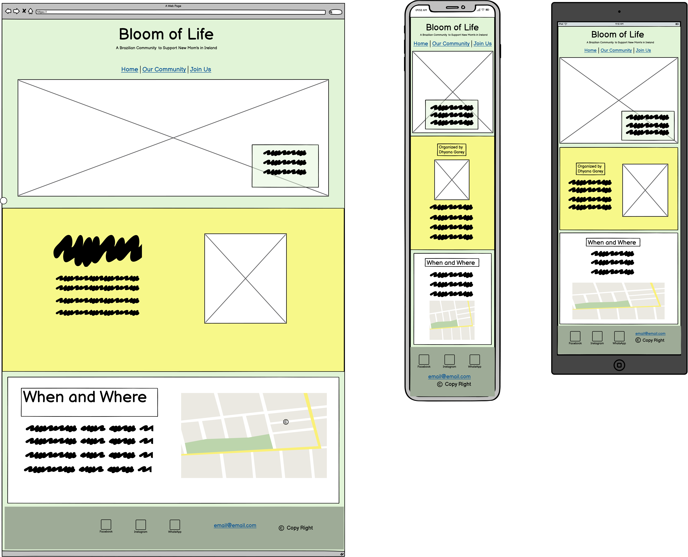
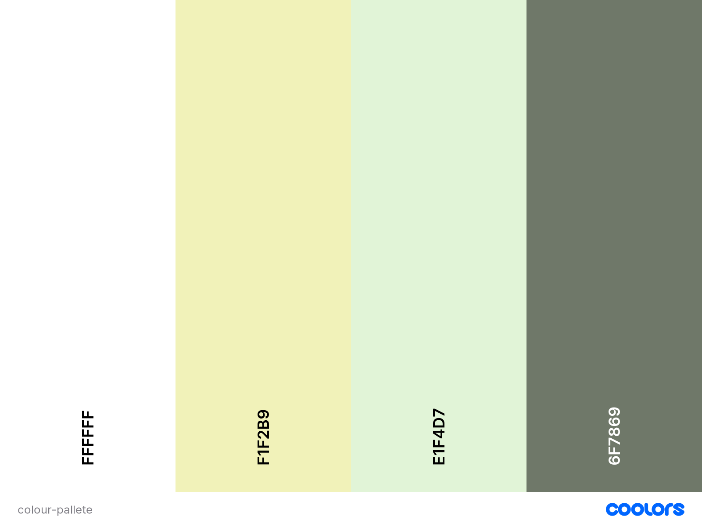

# Bloom of Life

Welcome,

This website was developed to create a *Brazilian community* of new moms or pregnant women in Ireland, and was called **Bloom of Life**. The aim of the project is **connect, inspire, and share** experiences with each other. Provide shelter for those insecure mothers in a different country and away from family, and care for those who feel alone throughout the challenges of maternity.

## User Experience (UX)

### User Stories

  - #### First-Time Visitor Goals
    1. As a First Time Visitor, I want to know more about what the community can offer.
    2. As a First Time Visitor, I want to have a clear understanding of where everything is located so that I can quickly access it.
    3. As a First Time Visitor, I want to have to able to access the menu so that I can decide what I want before attending the community.

  - #### Returning Visitor Goals
    1. As a Returning Visitor, I want to check for any updates on the schedules.
    3. As a Returning Visitor, I want to be able to find the contact information.

  - #### Frequent User Goals
    1. As a Frequent User, I want to check for any updates on the schedules.
    2. As a Frequent User, I want to use the map on the contact page to add to the route of my GPS.

  - ### Color Scheme
    - The colors were chosen to remind Brazilian flag with a variation of greens and yellow as the image below

    