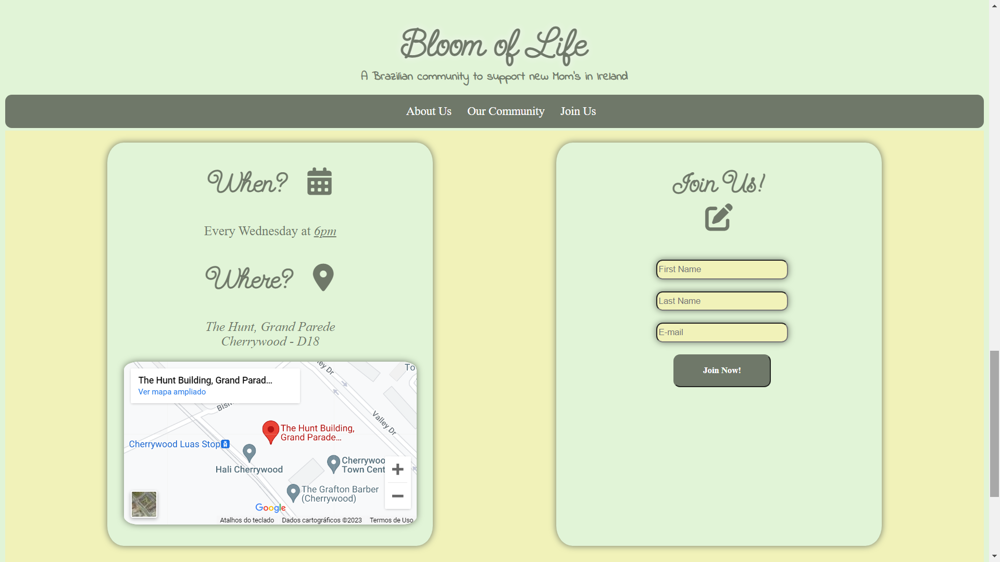
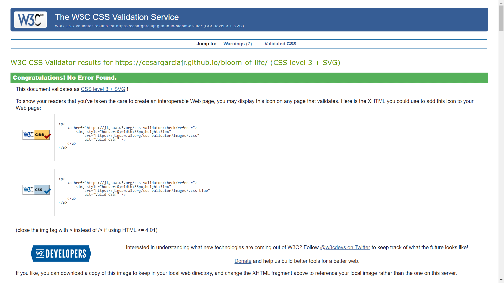
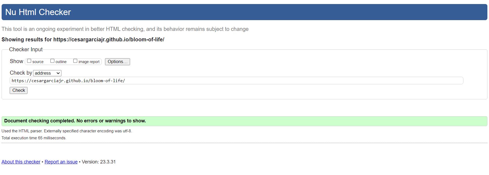

# Bloom Of Life

Welcome,

This website was developed to create a *Brazilian community* of new moms or pregnant women in Ireland, and was called [**Bloom Of Life**](https://cesargarciajr.github.io/bloom-of-life/#second-section). The aim of the project is *connect, inspire, and share* experiences. Provide shelter for those insecure mothers in a different country and away from family, and care for those who feel alone throughout the challenges of maternity.

[**Link for Bloom Of Life**](https://cesargarciajr.github.io/bloom-of-life/#second-section)

# Contents

* [**User Experience UX**](<#user-experience-ux>)
    *  [User Stories](<#user-stories>)
    * [Wireframes](<#wireframes>)
    * [Site Structure](<#site-structure>)
    * [Design Choices](<#design-choices>)
* [**Features**](<#features>)
    * [Landing Section](<#landing-section>)
    * [About Us Section](<#about-us-section>)
    * [Our Community Section](<#our-community-section>)
    * [Join Us Section](<#join-us-section>)
    * [Thank you Page](<#thank-you-page>)
    * [Footer](<#footer>)
    * [Future Features](<#future-features>)
* [**Testing**](<#testing>)
    * [Testing Process](<#testing-process>)
    * [Bugs and Issues](<#bugs-and-issues>)
* [**Technologies Used**](<#technologies-used>)
* [**Deployment**](<#deployment>)
* [**Credits**](<#credits>)
    * [Content](<#content>)
    * [Media](<#media>)
* [**Acknowledgments**](<#acknowledgments>)

    

## User Experience (UX)

  ### User Stories

  - #### First-Time Visitor Goals
    1. As a First Time Visitor, I want to know more about what the community can offer.
    2. As a First Time Visitor, I want to have a clear understanding of where everything is located so that I can quickly access it.
    3. As a First Time Visitor, I want to have to able to access the menu so that I can decide what I want before attending the community.

  - #### Returning Visitor Goals
    1. As a Returning Visitor, I want to check for any updates on the schedules.
    3. As a Returning Visitor, I want to be able to find the contact information.

  - #### Frequent User Goals
    1. As a Frequent User, I want to check for any updates on the schedules.
    2. As a Frequent User, I want to use the map on the contact page to add to the route of my GPS.

  [Back to top](<#contents>)
  
  - ### Wireframes

    The wireframes for Bloom Of Life were produced in [**Balsamiq**](https://balsamiq.com). There are frames for a full width display and a small mobile device. The final site varies slightly from the wireframes due to developments that occured during the creation process.

    

[Back to top](<#contents>)

  - ### Site Structure
    The site structure consists of a *"one-page"* with a *"sticky"* menu to make navigation easier through the website. There are 3 different sections such as [**Landing**](<#landing-section>), [**About Us**](<#about-us-section>), [**Our Community**](<#our-community-section>) and [**Join Us**](<#join-us-section>), also includes a [**Footer**](<#footer>) for social media and easy links to connect and get to know more about the project.

[Back to top](<#contents>)

  - ### Design Choices

    - #### Typography
        - The website uses three different fonts in a consistent distribution for better experience:
            1. Send Flowers or fallback cursive (https://fonts.google.com/)

            

            2. Indie Flower or fallback cursive (https://fonts.google.com/

            

            3. Sans- Serif or fallback Times New Roman

    - #### Color Scheme
        - The colors were chosen to remind Brazilian flag with a variation of greens and yellow as in the image below

  

[Back to top](<#contents>)

## Features
  Bloom Of Life site is set up to be welcoming and easy to use. It contains many features that the user would probably be familiar with, such as a navigation bar and contact form. The overall feel of the website is intended to be inviting and not intimidating to encourage the user to explore further. 
    
  ### Landing Section
  Here the user can clearly see the name of purpose of the community as well as the Nav Menu which allows the user to go a specific content related to the community. The landing page is the Hero Image of two pragnant women holding flowers matching the name of the community.

   

[Back to top](<#contents>)

  ### About Us Section
  Here the user gets to know more about the organizer of the community and what she can offer as well as a little bit about her background and experiences. Also includes a picture of her to create some affection with the user.
        
  

[Back to top](<#contents>)

  ### Our Community Section
  This section is desgined as a gallery and some of the "pilar words" of the community so the user can relate and get a a a better understanding of what to expect and what can contribute to the community.

   

[Back to top](<#contents>)

  ### Join Us Section
  In this section, the user can find useful information about time, location, and also how to subscribe to the community. Also were allocated a mini Google maps for a better experience if the user needs to get direction. There is also a form so the user can subscribe for any updates and be part of the community.
        
   

[Back to top](<#contents>)

  ### Thank you Page
  This page was created for a responsive after the form is submmitted and henrit the main website structure such as stiky menu on top with nav bar and links, and also footer with social media links.

   

[Back to top](<#contents>)

  ### Footer
  And finally a footer with some useful links for social media and email.

  

[Back to top](<#contents>)

  ### Future Features
  - There are a number of features that would improve the User Experience that I would like to implement in the future:
  - Have a Portuguese and English version of the website so the user can choose which language is preferable.
  - Implement some of the latest content published in some of the social media such as Instagram or Facebook so the user might feel interested and follow the social platforms as well.
  - Comments and reviews would allow users to engage with the content and provide recommendations to other users.

[Back to top](<#contents>)

## Testing
- Tested in differents mobile devices and chrome web browser
- Tested using the [**CCS validador**](https://www.w3.org/)
- Tested using the [**HTML validator**](https://validator.w3.org/nu/)
- Tested using the Lightroom dev tool from Google Chrome

You can see the reports below as mentioned before:

[Back to top](<#contents>)

  ### Testing Process
  | Test                | Action                   | Success Criteria  |
  | -------------       |-------------             | -----|
  | Landingpage loads      | Navigate to website URL  | Page loads < 5s, no errors |
  | Links            | Click on each Navigation link  | Correct section is redirected action performed |
  | Form validation  | Enter data into each input field, ensure only valid data is accepted | Form doesn't submit until correct data entered, error message shown |
  | Responsiveness | Resize the viewport window from 320px upwards with Chrome Dev Tools. Use Responsive Design Checker to test various mobile, tablet, and large screen sizes | Page layout remains intact and adapts to screen size as intended except footer |

[Back to top](<#contents>)

 ### Bugs and Issues

Debugging and troubleshooting were done constantly throughout development, however still two main problems with the website:

- The Sticky menu at the top of the page was designed to facilitate the navigation during the user experience however when clicking any of the sections, it crops a little bit at the top of the section

But it was supposed to look like this:

So we found a solution with Carl Murray to add the code below to "push" the content down when the nav bar is clicked in order to fit the content perfectly to the website frame

- Another bug I notice is when the website is in the mobile version the footer goes behind my content but only when mobile:

- The problem was the Join Us section had absolute height value of 700px so the container was overlaping the footer but then it was setted to 100% and the footer now is reponsive

[Back to top](<#contents>)

___

## Technologies Used
I used the following technologies, platforms and support in building my project:
- Wireframes and mockups were designed in [**Balsamiq**](https://balsamiq.com/wireframes/desktop/#)
- The website is built with HTML and CSS only.
- The [**Code Institute**](https://codeinstitute.net/) modules/lessons aided my learning and many of the concepts learned were applied in this project.
- [**GitHub**](https://github.com/Cesargarciajr/bloom-of-life) was used for the project repository.
- [**Google Fonts**](https://fonts.google.com/) was used for all fonts on the site.
- [**FontAwesome**](https://fontawesome.com/) was used for the social media icons which then had additional styling applied to them.
- [**Colors CO**](https://coolors.co/) was used to create a colour pallete for this readme file.
- [**Adobe Colors**](https://color.adobe.com/pt/create/color-contrast-analyzer) and contrast was used to pick color and check if the contrast was good enough for users.
- Also had to learn how to use Flexbox which plays a important role in positioning the sections and elements in the website which I learned from [**W3 Schools**](https://www.w3schools.com/default.asp)

[Back to top](<#contents>)

## Deployment

First of all you need to have a [**GitHub**](https://github.com/Cesargarciajr/bloom-of-life) account, I choose [**GitHub**](https://github.com/Cesargarciajr/bloom-of-life) because it's free and easy to create a repository to host your code and share with others.

- To create a repository you just need to go to the main page at the top right you will see a "+" button just click here and then new repository

- Select the name of the project and a description make it public and then create a repository

- Once you created your repository go the settings section and then click on pages

- Select the Branch as main and then save it.

- Finally, your repository is deployed and it should show you a link so you can share it with others.

[Back to top](<#contents>)

## Credits

  ### Content  
  - [**Code Institute**](https://codeinstitute.net/)  - HTML and CSS module content
  - [**GitHub**](https://github.com/) - for deployment and host.
  - [**GitPod**](https://gitpod.io/) - for IDE and editor of the code.
  - [**Rafael Allan**](https://www.linkedin.com/in/rafael-allan/) - helped with insights and coding tips.
  - [**Carl Murray**](https://github.com/CarlMurray) - helped with bugs fix and styling ideas.
  - [**Precious Ijege**](https://www.linkedin.com/in/precious-ijege-908a00168/) - Mentor helping with insights and coding fix.
  - [**CSS Tricks**](https://css-tricks.com/) - learn how to style better in CSS.
  - [**Jot Form**](https://www.jotform.com/) - learn how to create and style forms in html.
  - [**HubSpot**](https://blog.hubspot.com/website/how-to-embed-google-map-in-html) - learn how to use Google Maps API.
  - [**W3 Schools**](https://www.w3schools.com/) - used for multiples researches and tutorials in HTML and CSS.
  - [**Color Hunt**](https://colorhunt.co/) - used to select colors of the project.

[Back to top](<#contents>)

  ### Media
- [**Pexel**](https://www.pexels.com/) - for images and photos.
- [**iStock**](https://www.istockphoto.com/) - for images and photos.
- [**TinyPNG**](https://tinypng.com/) - resizing images.
- [**Adobe Color**](https://color.adobe.com/pt/create/color-contrast-analyzer) - used to check contrast between the colors picked for project.
- [**Colors CO**](https://coolors.co/) was used to create a colour pallete for this readme file.
- [**Balsamiq**](https://balsamiq.com/wireframes/) - used for wireframes.
- [**Font Awesome**](https://fontawesome.com/) - used for icons.
- [**Google fonts**](https://fonts.google.com/) - for fonts used in this project.
- [**Am I Resposive**](https://ui.dev/amiresponsive/) - for the  Hero image in the ReadMe file.
- [**ConvertIO**](https://convertio.co/) - used to convert all the photos to webp format file.

[Back to top](<#contents>)

## Acknowledgments

I'd to thank Code Institute for the opportunity of putting all the knowledge into practice. My mentor [**Precious Ijege**](https://www.linkedin.com/in/precious-ijege-908a00168/) and Alan Bushell, my cohort facilitator, for help with this project as well as extra people the helped me through my struggles and needs specially [**Rafael Allan**](https://www.linkedin.com/in/rafael-allan/) and [**Carl Murray**](https://github.com/CarlMurray).

by [**Cesar Garcia**](https://github.com/Cesargarciajr)

# THANK YOU!

[Back to top](<#contents>)
